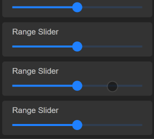

# Range Slider Touch

[![Version][version]][package]

Range slider web component optimized for touch.



## Features

- Scroll the page without accidentally changing the value.
- Single tap for single change or long press to move.
- Responsive size. Contains the parent size.
- Lightweight and simple modern appearance.
- Uses transform for performance reasons.

> Disclaimer:This component is currently experimental and not yet fully tested. It was created for demo purposes. It may not work in forms or all browsers. It also doesn't support keyboard yet.

## Getting Started

[NPM][package]:

```bash
npm i range-slider-touch
```

```ts
import 'range-slider-touch';
```

or CDN:

```html
<script
  type="module"
  src="https://unpkg.com/range-slider-touch@latest/dist/range-slider-touch/range-slider-touch.esm.js"
></script>
<script
  nomodule
  src="https://unpkg.com/range-slider-touch@latest/dist/range-slider-touch/range-slider-touch.js"
></script>
```

## Usage

```html
<range-slider-touch min="10" max="190" value="140" step="10"></range-slider-touch>
```

[Docs](./src/components/range-slider-touch/readme.md)

### Angular

Angular must be configured to allow custom elements. I recommend to wrap this web-component in an Angular component with its own module. But it also works in app.module.ts.

**range.module.ts**

```ts
import { NgModule, CUSTOM_ELEMENTS_SCHEMA } from '@angular/core';
import { defineCustomElements } from 'range-slider-touch/loader';

@NgModule({
  schemas: [CUSTOM_ELEMENTS_SCHEMA],
})

defineCustomElements();
```

### Styles

This component uses the current `color` for its color.

```css
range-slider-touch {
  color: #2080ff;
}
```

Some customizations:

```css
range-slider-touch {
  --border-radius: 3px;
  --background-opacity: 0.1;
  color: #ffdd22;
}

range-slider-touch::part(thumb) {
  display: none;
}
```

### Quirks

If you don't want to scroll the content during slider movements, you can prevent this by using the `touch-action` CSS property. Unfortunately, this cannot be changed dynamically in the long press event as it must be set before a touch begins.

```css
range-slider-touch {
  touch-action: none;
}
```

## Story

The native range slider of HTML looks outdated and is not suitable for touch devices, especially when placed within a scrollable container. Scrolling can change the value of the slider unintentionally. The input range on iOS works better than on Android. I haven't seen a range slider for HTML that works well for touch. That's why I decided to build my own.

I don't want to change the value of the range slider while scrolling the content. I decided to only move the slider by long pressing. The idea is simple, but you have to deal with limitations and quirks of the browsers. Preventing scrolling via touch events is not possible. And pointer events can be canceled any time. You can only use the CSS property `touch-action` to control it. But it cannot be changed dynamically. It must be set before touch start. Means, we cannot activate it during a long press. Because the range is already touching. A dilemma. I decided to allow scrolling during range movement as it's less disruptive and otherwise this component would become unnecessary.

In my opinion, the HTML input range should behave like the range slider of the OS (e.g. audio settings). Maybe that will never happen. I won't wait, so I've developed an alternative here. It may not be perfect either, but it works better for touch than the original. Feel free to constribute and improve this component.

<!-- Links -->

[version]: https://img.shields.io/npm/v/range-slider-touch.svg?style=flat-square
[package]: https://www.npmjs.com/package/range-slider-touch
